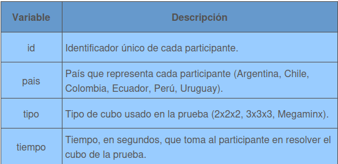

```{r setup, include=FALSE, message=FALSE}
knitr::opts_chunk$set(echo = TRUE)

library(ggpubr)
library(gridExtra)
library(cowplot)
library(ez)
library(stats)
```

## Actividades
En una emocionante competencia de cubos Rubik, participantes de Chile, Argentina, Colombia, Uruguay, Perú y Ecuador demostraron su destreza en resolver tres tipos de cubos: 2x2x2, 3x3x3 y Megaminx.
Después del torneo, un grupo de investigadores de la Asociación Mundial del Cubo, interesado en los tiempos que hicieron las jugadoras y los jugadores en la competencia, decidieron estudiar si el país y el tipo de cubo usado en cada prueba tienen influencia en los segundos que se tardan en resolverlos. Para ello usaron una muestra aleatoria de los datos de la competencia, en la cual participaron más de 2.000 personas, con las siguientes variables:

<center>

</center>
En el contexto de este estudio, realizaremos las siguientes actividades:

1. Copiar el enunciado del problema asignado como comentario de un script R.
2. Obtener los datos, disponibles en el archivo "EP05 Datos.csv", desde el directorio compartido correspondiente.
3. Familiarizarse con los datos entregados, y enunciar las hipótesis nula y alternativa para el procedimiento ANOVA.
4. Analizar si se cumplen las condiciones para usar un procedimiento ANOVA y agregar código al script R para verificarlo.
5. Independiente del resultado anterior, aplicar una prueba ANOVA ómnibus a los datos y entregar una conclusión usando un nivel de significación adecuado.
6. Determinar si corresponde o no aplicar un análisis post-hoc, justificando adecuadamente la opción escogida. Independiente del resultado anterior, aplicar un análisis post-hoc pertinente y comentar los resultados obtenidos.
7. Redactar la respuesta a la pregunta planteada (comentario) en base a los resultados del análisis realizado.

## Pregunta a responder

> ¿Existen diferencias en el tiempo de resolución de cubos 2x2x2 entre participantes de Uruguay, Perú y Ecuador?

## Solución:

### 1) Leer los datos proporcionados en el CSV

```{r}
datos <- read.csv2("EP05 Datos.csv")
datos_2por2 <- datos[datos$tipo == "2x2x2", ]
uruguay <- datos_2por2[datos_2por2$pais == "Uruguay", ]
peru <- datos_2por2[datos_2por2$pais == "Perú", ]
ecuador <- datos_2por2[datos_2por2$pais == "Ecuador", ]
```

### 2) Familiarización con los datos y enunciación de las hipótesis a contrastar
Los datos corresponden a tiempos registrados en una competencia de cubos Rubik, en este caso nos interesa únicamente la categoría de 2x2x2, los grupos a docimar vendrían siendo 3 paises distintos, siendo Uruguay, Perú y Ecuador; nos interesa inferir acerca de las medias de múltiples muestras independientes, por lo que se procederá a enunciar las hipótesis para el posterior análisis inferencial:

- $H_0$: El tiempo medio de resolución para cubos de 2x2x2 es igual entre Uruguay, Perú y Ecuador. Osease, **no existe diferencia significativa entre los tiempos medios**.

- $H_A$: El tiempo medio de resolución para cubos de 2x2x2 **es diferente para al menos uno de los 3 países.** Matemáticamente, $\exists\  i,j \in \{\text{Peru}, \text{Ecuador}, \text{Uruguay} \}, i \neq j \ |\ \mu_i \neq \mu_j$

Para contrastar de manera eficiente, se hará utilización del test de Análisis de Varianza (ANOVA).


### 3) Análisis de condiciones para el uso del test de ANOVA

1. **Condición de aleatoreidad:**

En este caso, el mismo ejercicio declara que la muestra fue elegida de manera aleatoria, y es posible declarar que los resultados de un participante no afecta el rendimiento o influye el tiempo de otros.

2. **Escala de variable dependiente sigue propiedad de escala de intervalos iguales:**

Cómo la variable tiempo se mide en una escala de segundos hasta 2 puntos decimales de presición, esta sigue la propiedad de intervalos iguales, por ejemplo, si pasan 4 segundos en algún tiempo medido por concursante, los mismos 4 segundos aplican para otro tiempo registrado.

3. **Suponemos que poblaciones siguen una distribución normal**

```{r}
qq_peru <- ggqqplot(data = data.frame(peru$tiempo),x = "peru$tiempo",main="Grafico qq peru 2x2x2",xlab="Peruanos",ylab="tiempos")

qq_ecuador <- ggqqplot(data = data.frame(ecuador$tiempo),x = "ecuador$tiempo",main="Grafico qq ecuador 2x2x2",xlab="Ecuatorianos",ylab="tiempos")

qq_uruguay <- ggqqplot(data = data.frame(uruguay$tiempo),x = "uruguay$tiempo",main="Grafico qq Uruguayos 2x2x2",xlab="Uruguayos",ylab="tiempos")

plot_grid(qq_peru, qq_ecuador, qq_uruguay, labels = "AUTO")
```

4. **Prueba de homogeneidad de las varianzas:**

Con las sgtes lineas de codigo averiguaremos si el conjunto de muestras que vamos a estudiar tiene la propiedad de homogeneidad:
```{r}
peru_var<- var(peru$tiempo)
ecu_var <- var(ecuador$tiempo)
uru_var <- var(uruguay$tiempo)
homogeneidad = max(c(ecu_var, peru_var, uru_var)) / min(c(ecu_var, peru_var, uru_var))
print(homogeneidad)
```
Con un valor de $\sigma ^2_{max} \div \sigma ^2_{min} = `r homogeneidad` \leq 1.5$ somos capaces de llevar a cabo el test ANOVA para averiguar si existen diferencias de tiempos entre los 3 países. 


### 4) Aplicación de ANOVA
Cómo ya conocemos las hipótesis a contrastar y además vemos que se cumplen las condiciones, se procederá a emplear dos test de ANOVA.

```{r}
# Con prueba aov
tiempos_peru <- peru$tiempo
tiempos_ecuador <- ecuador$tiempo
tiempos_uruguay <- uruguay$tiempo

# como tienen largo distinto, se generan datos largos
# https://stackoverflow.com/questions/8320603/how-to-do-one-way-anova-in-r-with-unequal-sample-sizes
datos_largos <- data.frame(
       tiempo=c(tiempos_peru, tiempos_ecuador, tiempos_uruguay),
       pais=factor(rep(c("peru", "ecuador", "uruguay"), instancia=c(length(tiempos_peru), length(tiempos_ecuador), length(tiempos_uruguay)))))

# de la lectura 3
datos_largos[["pais"]] <- factor(datos_largos[["pais"]])
datos_largos[["instancia"]] <- factor(1:nrow(datos_largos))

prueba_aov <- aov(tiempo~pais, data = datos_largos)
summary(prueba_aov)

p_valor_aov <- summary(prueba_aov)[[1]][["Pr(>F)"]][1]
```

Para la prueba empleada, usando `aov()`, entrega un p-value de $`r p_valor_aov`$ .

```{r}
# Usando ezANOVA
prueba_ez <- ezANOVA(data = datos_largos, dv = tiempo, between = pais, wid = instancia, return_aov = TRUE)
print(prueba_ez)
```

Mas aún, efectuando el método de `ezANOVA()`, se confirma la homogeneidad de las muestras con el test de Levenne, dando este un valor de $p$ bastante alto, así no podemos negar la homogeneidad de las muestras que fueron previamente estudiadas. Finalmente, con `ezANOVA()` entrega el mismo valor $p$ que el calculado usando la implementación de `aov()`.

Cómo se presenta un valor de $p$ significativamente alto $p = `r p_valor_aov` \geq 0.05$, entonces **no tenemos la evidencia suficiente para rechazar la hipótesis nula inicialmente planteada.**

### 5) Análisis Post-Hoc

Si bien no podemos rechazar la hipótesis nula, se indica en el ejercicio que se debe hacer un análisis post-hoc, por tanto **se procederá a hacer un Procedimiento HSD (honest significant differences) de Tukey.**

```{r}
# https://stats.stackexchange.com/questions/253588/interpreting-tukeyhsd-output-in-r
hsd <- TukeyHSD(prueba_aov, "pais", ordered = TRUE, conf.level = 0.05)
print(hsd)
```

En base al análisis vemos que existe una mayor diferencia entre Ecuador y Perú, puesto que posee el mayor valor en la columna `diff`, de igual manera, vemos que el p-valor adjunto, representado por la columna `p adj` es más cercano al p-valor obtenido en el test original de ANOVA.


De todas formas, cómo no se encontró una diferencia significativa entre las 3 muestras, **no tiene mucho sentido hacer el análisis post-hoc**, puesto que incluso entre Ecuador y Perú **no existe una diferencia suficientemente significativa.**

### 6) Respuesta a la pregunta

Finalmente, con todo este estudio podemos concluir:

- **De la prueba de ANOVA:** Cómo fue previamente mencionado, no se puede rechazar la hipótesis nula, por lo que **los datos sugieren con un nivel de significancia del $5\%$ que no existe una diferencia significativa en los tiempos medidos entre los participantes de nacionalidad Peruana, Ecuatoriana y Uruguaya.**
- **Del procedimiento post-hoc:** Si bien, no tiene mucho sentido emplear un procedimiento post-hoc, ya que no existe una diferencia significativa entre muestras, se concluye que entre las 3 muestras, la diferencia más grande existe entre Ecuador y Perú.